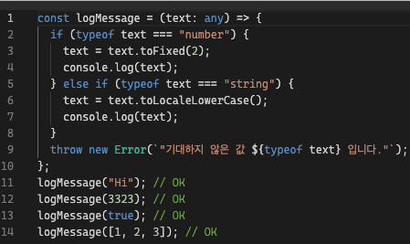
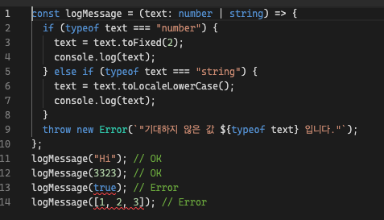

# Union, Intersection Type

## Union Type (|)

Union Type은 여러 타입 중 하나일 수 있는 값을 나타냅니다. 세로 막대(|)를 사용하 각 유형을 구분할 수 있습니다.

```js
const a: number | string | boolean = 13;
console.log(a);

const logMessage = (text: string | number) => {
  console.log(text);
};
logMessage("Hi");
logMessage(4434);
```

## Union Type 장점

any로 인자값을 받았을 경우에는 컴파일시에는 오류를 잡을 수 없고 실제 브라우저 환경에서 사용자가 사용하다가 오류를 인지할 수 있다.

```js
const logMessage = (text: any) => {
  if (typeof text === "number") {
    text = text.toFixed(2);
    console.log(text);
  } else if (typeof text === "string") {
    text = text.toLocaleLowerCase();
    console.log(text);
  }
  throw new Error(`"기대하지 않은 값 ${typeof text} 입니다."`);
};
logMessage("Hi"); // OK
logMessage(3323); // OK
logMessage(true); // OK
logMessage([1, 2, 3]); // OK
```


유니언 타입으로 개발을 할 경우에는 개발 단계에서 오류를 미리 검증할 수 있어서 프로덕트 모드에서 오류를 줄일 수 있는 기회가 생긴다.

```js
const logMessage = (text: number | string) => {
  if (typeof text === "number") {
    text = text.toFixed(2);
    console.log(text);
  } else if (typeof text === "string") {
    text = text.toLocaleLowerCase();
    console.log(text);
  }
  throw new Error(`"기대하지 않은 값 ${typeof text} 입니다."`);
};
logMessage("Hi"); // OK
logMessage(3323); // OK
logMessage(true); // Error
logMessage([1, 2, 3]); // Error
```



## Union Type 주의사항

(|) 연산자를 사용하기 때문에 논리적인 연산에 의해 OR로 생각할 수 있으나 실제로 사용시에는 다음과 같은 오류사항을 만날 수 있습니다.

```js
interface Fruit {
  name: string;
  color: string;
}
interface Noodle {
  name: string;
  price: number;
}
const getFood = (food: Fruit | Noodle) => {
  food.name; // OK
  food.color; // Error
  food.price; // Error
};
```

`getFood`함수를 호출 시에는 오류가 발생하는데 `color`속성은 Fruit에만 정의되어 있고 `price`속성은 Noddle에만 정의되어 있습니다. 그렇기 때문에 함수를 호출할 때 과일인지 면인지 정확히 모르기 때문에 타입스크립트는 `color`,`price` 속성을 정확하게 추론을 할 수가 없습니다.
Type Guard(타입 보호)를 이용해서 타입을 보호 해주지 않는 이상 두 인터페이스의 공통적인 속성만 접근을 할 수 있습니다.

```js
const getFood = (food: Fruit | Noodle) => {
  food.name; // OK
  if (isFruit(food)) {
    food.color; // OK
  } else if ((food as Noodle).price) {
    food.price; // OK
  }
};

// Type Guard 정의
const isFruit = (food:  Fruit | Noodle):food is Fruit => {
    return (food as  Fruit).color !==  undefined;
}
```

## Intersection Type (&)

교차타입은 여러개의 타입을 모두 만족하는 타입으로 정의 합니다. 변수에서 사용하는 것보다 주로 인터페이스에서 많이 사용이 됩니다.

```js
interface Food {
  country: string;
}
interface Fruit {
  name: string;
  color: string;
  isSweet: boolean;
}

type Banana = Food & Fruit;

const getFruit = (banana: Banana) => {
  console.log(banana.country);
  console.log(banana.name);
  console.log(banana.color);
  console.log(banana.isSweet);
};

getFruit({
  country: "India",
  name: "banana",
  color: "yellow",
  isSweet: true,
});

// India
// banana
// yellow
// true
```
