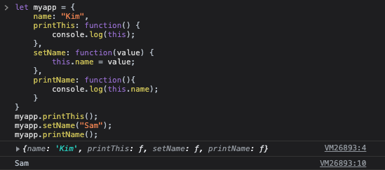
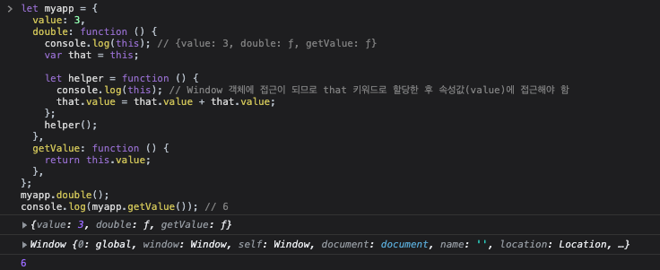
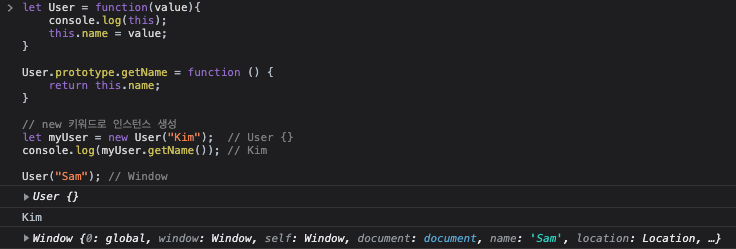
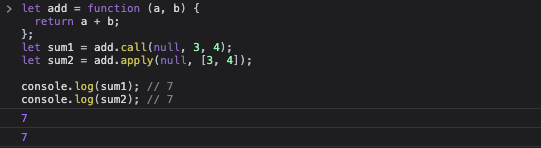

# 호출(this의 용법)

함수를 호출 하면 현재 함수의 실행을 잠시 중단하고 제어를 매개변수와 함께 호출한 함수로 넘겨집니다. 모든 함수는 명시되어 있는 매개변수에 더해서 `this`, `arguments`라는 추가적인 매개변수 두 개를 받게 됩니다. `this`라는 매개변수는 객체지향 프로그래밍 관점에서 매우 중요합니다.

이 매개변수의 값은 호출하는 패턴에 의해 결정이 되며 자바스크립트에서 함수를 호출하는데에는 네 가지 패턴이 있습니다. 각각의 패턴에 따라 `this`라는 추가적인 매개변수를 다르게 초기화 합니다.

## 메소드 호출 패턴

함수를 객체의 속성에 저장하는 경우 이 함수를 메소드라고 부릅니다. 메소드를 호출할 때, `this`는 메소드를 포함하고 있는 객체에 바인딩 됩니다. 즉 `this`는 객체 자체가 됩니다. 호출되는 표현식이 세부지정(체인형식)을 포함하고 있으면 이 방법이 메소드 호출 패턴 입니다.

```js
let myapp = {
  name: "Kim",
  printThis: function () {
    console.log(this);
  },
  setName: function (value) {
    this.name = value;
  },
  printName: function () {
    console.log(this.name);
  },
};
myapp.printThis(); // {name: 'Kim', printThis: ƒ, setName: ƒ, printName: ƒ}
myapp.setName("Sam");
myapp.printName(); // Sam
```

결과 화면


메소드는 자신을 포함하는 객체의 속성들에 접근하기 위해서 `this`를 사용할 수 있습니다. 즉 `this`를 사용해서 객체의 값을 읽거나 변경할 수 있습니다. `this`와 객체의 바인딩은 호출 시에 일어나며 효율적으로 사용하는 함수를 만들 수 있습니다. 자신의 객체 문맥을 `this`로 얻는 메소드를 퍼블릭 메소드라고 불립니다.

## 함수 호출 패턴

함수가 객체의 속성이 아닌 경우에는 함수로서 호출이 됩니다.

```js
let sum = add(3, 4); // 합은 7
```

함수 호출 패턴으로 호출할 경우의 `this`는 전역객체(`window`)에 바인딩이 됩니다. 이런 특성은 언어 설계 단계에서 실수인데 만약 언어를 바르게 설계했다면 내부 함수를 호출 할 때 이 함수의 `this`는 외부 함수의 `this`변수(상위객체 {})에 바인딩 되어야 합니다. 하지만 이런 오류 때문에 메소드가 내부 함수를 사용하여 자신의 작업을 도울 수가 없습니다.
왜냐하면 내부 함수는 메소드가 객체 접근을 위해 사용하는 `this`에 자신의 `this`를 바인딩하지 않고 엉뚱한 값(전역객체, window)에 연결되기 때문입니다. 대안의 방법으로는 메소드에서 변수를 정의한 후 여기에 `this`를 할당하고, 내부 함수는 이 변수를 통해서 메소드의 `this`에 접근 하는 방법입니다. 관례상 이 변수는 `that`이라고 구현 합니다.

이 패턴은 추후 자바스크립트의 디자인 패턴 중 `모듈패턴`에서 많이 사용되는 방법 입니다.

```js
let myapp = {
  value: 3,
  double: function () {
    console.log(this); // {value: 3, double: ƒ, getValue: ƒ}
    var that = this;

    let helper = function () {
      console.log(this); // Window 객체에 접근이 되므로 that 키워드로 할당한 후 속성값(value)에 접근해야 함
      that.value = that.value + that.value;
    };
    helper();
  },
  getValue: function () {
    return this.value;
  },
};
myapp.double();
console.log(myapp.getValue()); // 6
```

결과화면


## 생성자 호출 패턴

자바스크립트는 프로토타입에 의해서 상속이 이루어지는 언어입니다. 즉 객체가 자신의 속성들을 다른 객체에 바로 상속할 수 있다는 뜻입니다. 자바스크립트는 클래스가 없습니다.

이러한 특성은 다른 언어들과는 조금 다릅니다. 오늘날의 대부분의 언어는 클래스를 기반으로 하고 있습니다. 프로토타입에 의한 상속은 매우 표현적이지만 널리 알려져 있지 않습니다. 자바스크립트 자체도 자신의 프로토타입적 본성에 확신이 없었는지 클래스 기반의 언어들을 생각나게 하는 객체 생성 문법을 제공 합니다.

클래스 기반의 프로그래밍에 익숙한 개발자들에게 프로토타입에 의한 상속은 받아들여지지 못했고 클래스를 사용하는 듯한 구문은 자바스크립트의 프로토타입적 속성을 애매하게 만들었습니다.

함수를 `new`라는 전치 연산자와 함께 호출하면 호출된 함수의 `prototype`속성의 값에 연결되는 링크를 갖는 객체가 생성되고 이 새로운 객체는 `this`에 바인딩 됩니다.

```js
let myApp = function (value) {
  console.log(this);
  this.name = value;
};

User.prototype.getName = function () {
  return this.name;
};

// new 키워드로 인스턴스 생성
let myUser = new User("Kim"); // User {}
console.log(myUser.getName()); // Kim

User("Sam"); // Window
```

`new`라는 키워드로 `User` 인스턴스를 생성할 경우의 `this`는 객체를 가리키지만 일반 함수로 `User`호출할 경우의 `this`는 `Window`가 바인딩 됩니다.

결과화면


## apply, call 호출 패턴

자바스크립트는 함수형 객체지향 언어이기 때문에 함수는 메소드를 가질 수 있습니다. `apply`메소드는 함수를 호출할 때 사용할 인수들의 배열을 받아들입니다. 반면 `call`메소드는 함수를 호출할 때 사용할 인수들을 각각의 변수로 받아들입니다. 또한 이 메소드는 `this`의 값을 선택할 수 있도록 해줍니다. `apply`메소드에는 매개변수 두 개가 있으며 첫 번째는 `this`에 묶이며 두 번째는 매개변수들의 배열 입니다.

```js
let add = function (a, b) {
  return a + b;
};
let sum1 = add.call(null, 3, 4);
let sum2 = add.apply(null, [3, 4]);

console.log(sum1); // 7
console.log(sum2); // 7
```

결과화면


## 결론

함수를 호출 하는 방법에 따라 `this`가 다르게 바인딩이 됩니다.

- 메소드 호출 패턴
  - `this`: 함수 자신 객체
- 함수 호출 패턴
  - `this`: 함수 자신 객체로 바인딩이 되지만 클로저(함수 내부에 함수가 있는 경우)가 있을 경우 `window`로 바인딩 되기 때문에 `that`을 이용하여 접근한다.
- 생성자 호출 패턴
  - `this`: `new` 키워드로 호출할 경우에만 객체로 바인딩
- apply, call 호출 패턴
  - `this`: 첫 번째 매개변수
