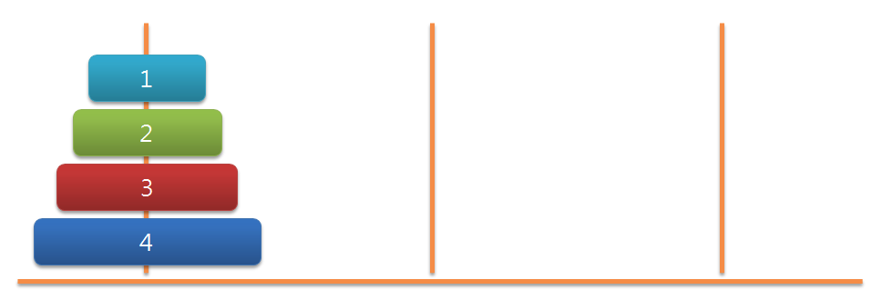

# 재귀적 호출

재귀 함수는 직접 또는 간접적으로 자신을 호출하는 함수 입니다. 재귀적 호출은 어떤 문제가 유사한 하위 문제로 나뉘어지고 각각의 문제를 같은 해결 방법으로 처리할 수 있을 때 사용할수 있는 프로그래밍 기법입니다. 일반적으로 재귀함수는 하위 문제를 처리하기 위해 자신을 호출 합니다.

### 하노이 탑

하노이 탑은 유명한 퍼즐입니다. 이 퍼즐에는 3개의 기둥과 가운데 구멍이 있는 다양한 지름의 원반이 있습니다. 먼저 시작 기둥에 원반들을 지름이 큰 것에서부터 작은 것으로 차례로 쌓습니다. 목표는 한 번에 원반 하나를 다른 기둥으로 옮기면서 최종적으로 목적 기둥에 원래의 순서대로 쌓는 것입니다.



```js
let hanoi = function (disc, src, aux, dst) {
  if (disc > 0) {
    hanoi(disc - 1, src, dst, aux);
    console.log(`Move disc ${disc} from ${src} to ${dst}`);
    hanoi(disc - 1, aux, src, dst);
  }
};
hanoi(4, 'Src', 'Aux', 'Dst');

// Move disc 1 from Src to Aux
// Move disc 2 from Src to Dst
// Move disc 1 from Aux to Dst
// Move disc 3 from Src to Aux
// Move disc 1 from Dst to Src
// Move disc 2 from Dst to Aux
// Move disc 1 from Src to Aux
// Move disc 4 from Src to Dst
// Move disc 1 from Aux to Dst
// Move disc 2 from Aux to Src
// Move disc 1 from Dst to Src
// Move disc 3 from Aux to Dst
// Move disc 1 from Src to Aux
// Move disc 2 from Src to Dst
// Move disc 1 from Aux to Dst
```
