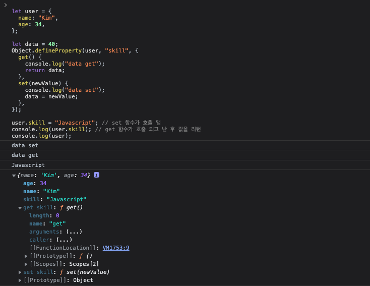

# 객체

## assign

객체를 병합해서 새로운 객체로 반환합니다.

```js
let o1 = { a: 1 };
let o2 = { b: 2 };
let o3 = { c: 3 };

let obj = Object.assign(o1, o2, o3);
console.log(obj); // { a: 1, b: 2, c: 3 }
console.log(o1); // { a: 1, b: 2, c: 3 }, 목표 객체 자체가 변경됨.
```

만약 같은 속성을 가지고 있다면 뒤에 있는 객체가 앞의 객체를 덮어 씁니다.

```js
let o1 = { a: 1, b: 1 };
let o2 = { b: 2 };
let o3 = { c: 3 };

let obj = Object.assign(o1, o2, o3);
console.log(obj); // { a: 1, b: 2, c: 3 }
console.log(o1); // { a: 1, b: 2, c: 3 }, 목표 객체 자체가 변경됨.
```

## defineProperty

정적 메소드는 객체에 새로운 속성을 직접 정의하거나 이미 존재하는 속성을 수정한 후 해당 객체를 반환합니다.

```js
let object1 = {};

Object.defineProperty(object1, "property1", {
  value: 32,
  writable: false,
  get,
});

object1.property1 = 11; // writable 값이 false 이기 때문에 속성 값이 변경되지 않음
console.log(object1.property1); // 32
```

다른 예제를 살펴보겠습니다.

```js
let user = {
  name: "Kim",
  age: 34,
};

let data = 40;
Object.defineProperty(user, "skill", {
  get() {
    console.log("data get");
    return data;
  },
  set(newValue) {
    console.log("data set");
    data = newValue;
  },
});

user.skill = "Javascript"; // set 함수가 호출 됌
console.log(user.skill); // get 함수가 호출 되고 난 후 값을 리턴
console.log(user);

// data set
// data get
// Javascript
// { name: 'Kim', age: 34 }
```

결과화면
`skill` 조회시 객체로 조회를 하면 나오지는 않으나 속성을 직접 조회하면 사용할 수 있음. `enumerable` 속성을 `true` 지정해 주면 객체로 조회시 확인이 가능하다.



## entries

메서드는 `for...in`와 같은 순서로 주어진 객체 자체의 `enumerable` 속성 `[key, value]` 쌍의 배열을 반환합니다.

```js
let user = {
  name: "Kim",
  age: 34,
  skill: ["Javascript", "React"],
};

for (const [key, value] of Object.entries(user)) {
  console.log(`${key}: ${value}(${typeof value})`);
}
// name: Kim(string)
// age: 34(number)
// skill: Javascript,React(object)
```

## freeze

객체를 동결합니다. freeze 메소드로 동결된 객체는 속성을 변경할 수가 없습니다. 동결된 객체는 속성을 추가하거나 삭제하는 것도 되지 않으며 속성의 내용을 변경하는 것도 안됩니다. 객체를 불변성하게 만들기 위해 사용합니다.

```js
let user = {
  name: "Kim",
  age: 34,
  skill: ["Javascript", "React"],
};
Object.freeze(user);

user.name = "Sam";

console.log(user.name); // Kim
```

## hasOwnProperty

객체에 속성이 있는지 확인합니다. `boolean`으로 반환합니다.

```js
let user = {
  name: "Kim",
  age: 34,
  skill: ["Javascript", "React"],
};
console.log(user.hasOwnProperty("name")); // true
console.log(user.hasOwnProperty("location")); // false
```

## getOwnPropertyNames

객체의 속성을 전부 배열로 반환합니다.

```js
let user = {
  name: "Kim",
  age: 34,
  skill: ["Javascript", "React"],
};

console.log(Object.getOwnPropertyNames(user)); // ["name", "age", "skill"]
```

## preventExtensions

객체에 추가적인 속성의 확장을 막습니다.

```js
let user = {
  name: "Kim",
  age: 34,
  skill: ["Javascript", "React"],
};

Object.preventExtensions(user);

try {
  Object.defineProperty(user, "location", {
    value: "kr",
  });
} catch (e) {
  console.log(e); // TypeError: Cannot define property property1, object is not extensible
}
```

## isExtensible

객체가 확장가능한지 판별합니다. `boolean`으로 반환합니다.

```js
let user = {
  name: "Kim",
  age: 34,
  skill: ["Javascript", "React"],
};

console.log(Object.isExtensible(user)); // true
Object.preventExtensions(user);
console.log(Object.isExtensible(user)); // false
```

## isFrozen

객체가 동결되었는지 판별합니다. `boolean`으로 반환합니다.

```js
let user = {
  name: "Kim",
  age: 34,
  skill: ["Javascript", "React"],
};

console.log(Object.isFrozen(user)); // true
Object.freeze(user);
console.log(Object.isFrozen(user)); // false
```
