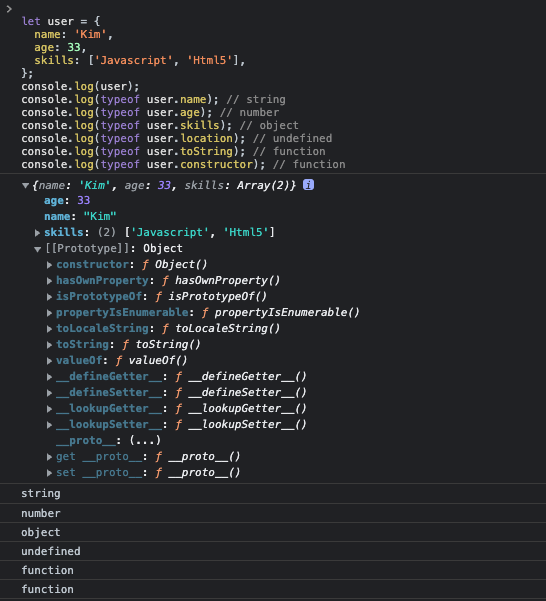

# 리플렉션

객체에 어떤 속성들이 있는지는 속성을 접근해서 반환하는 값을 보면 쉽게 확인을 할 수 있습니다. `typeof`연산자를 이용하여 속성의 타입을 알아볼 수 있습니다.

```js
let user = {
  name: 'Kim',
  age: 33,
  skills: ['Javascript', 'Html5'],
};
console.log(user);
console.log(typeof user.name); // string
console.log(typeof user.age); // number
console.log(typeof user.skills); // object
console.log(typeof user.location); // undefined
console.log(typeof user.toString); // function
console.log(typeof user.constructor); // function
```

::: tip
`toString`, `constructor`의 경우에는 속성으로 선언하지 않았지만 프로토타입체인에 의해 속성을 반환할 수 있습니다.
:::

